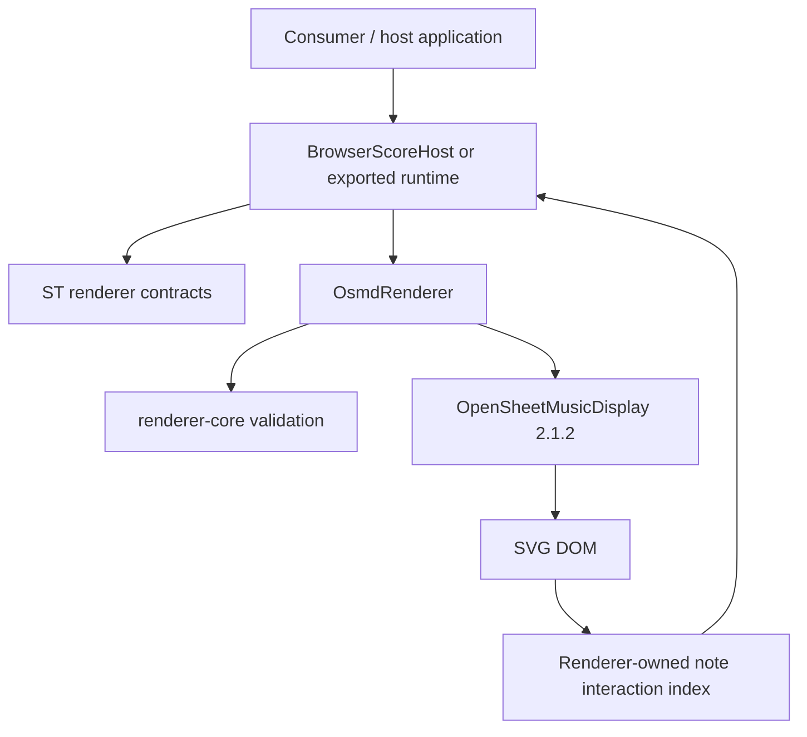

# ST Score Rendering Layer

Vendor-isolated notation presentation boundary for the ST music ecosystem.

## What this repository does

`st-score-rendering-layer` accepts **bounded in-memory MusicXML text** and renders it through ST-owned contracts and adapters. The current browser implementation delegates notation parsing/layout/drawing to OpenSheetMusicDisplay (OSMD) `2.1.2`, while keeping OSMD objects and imports behind the ST adapter boundary.

The repository currently provides:

- vendor-neutral renderer contracts (`@st/score-renderer-contracts`);
- shared source validation and renderer lifecycle utilities (`@st/score-renderer-core`);
- interactive browser rendering through the OSMD adapter;
- deterministic headless SVG rendering for CI/visual QA;
- browser-host APIs for render, SVG export, measure cursor, exact note hit-test and highlight;
- a reversible accessibility overlay;
- renderer-owned Workstation and generic browser runtime exports with manifest/integrity metadata;
- validated standard-notation + guitar-TAB rendering, including string/fret display evidence.

## What this repository does not do

This repository is **not** an OMR engine, correction engine, canonical score database, ScoreGraph implementation, editor, playback engine, MIDI engine, audio engine or application UI shell.

It does not import PDF/image/MXL/JSON score sources. Its source contract is MusicXML text only. OMR, Score Restore, ScoreMosaic, ST OMR Correction Engine and other producers may provide MusicXML to this boundary, but their recognition/correction authority remains outside the renderer.

Playback availability is also outside this repository. A host application must not treat renderer validation as an audio/playback authorization gate unless that rule is defined independently by the host.

## Production architecture



The browser host owns only its presentation container and renderer lifecycle. File upload, navigation, selected-note application state, canonical-note resolution, playback controls, authentication and business UI remain host responsibilities.

For the complete production-reality architecture, see [docs/ARCHITECTURE.md](docs/ARCHITECTURE.md).

## Note interaction

The renderer does **not** bind touch/pointer listeners. A host supplies browser `clientX/clientY` coordinates to `hitTestNote()`.

The OSMD adapter resolves the browser hit through `document.elementFromPoint()` and a renderer-owned DOM-to-`ScoreNoteRef` index. Exact noteheads are strongest identity targets; a uniquely owned graphical-note group may widen touch ownership to its stem/flag/dot descendants. Shared/ambiguous groups fail closed. There is no nearest-note search, pitch matching, radius expansion or consumer-side SVG scraping.

See [docs/NOTE-INTERACTION.md](docs/NOTE-INTERACTION.md) and [docs/MOBILE-SAFARI.md](docs/MOBILE-SAFARI.md).

## Consumer integration

Consumers must use ST-owned package/runtime boundaries rather than import OSMD directly. The generic browser runtime exposes renderer-owned presentation operations through `globalThis.__ST_SCORE_RENDER_HOST__`; the Workstation export adds its reviewed native bridge on top of the same browser-host boundary.

SesliTab may use the renderer for presentation and note interaction, but canonical note identity remains SesliTab-owned: `ScoreNoteRef` is a deterministic **rendered-note locator**, not a global canonical note ID.

See [docs/CONSUMER-INTEGRATION.md](docs/CONSUMER-INTEGRATION.md) and [docs/PUBLIC-API.md](docs/PUBLIC-API.md).

## Build and validation

Requires Node.js `>=20.19.0`.

```bash
npm install --ignore-scripts --no-audit --no-fund
npm run check
npm run test:browser
npm run test:headless
```

`npm run check` performs TypeScript typecheck, build and unit tests. Browser gates run real Chrome/Chromium fixtures. The headless gate performs real headless rendering and visual-regression checks. There is currently **no automated Safari/WebKit test job** in this repository.

The protected `main` branch requires a pull request and the `foundation` status check.

## Documentation

- [Production architecture](docs/ARCHITECTURE.md)
- [Production-reality audit](docs/PRODUCTION-REALITY-AUDIT.md)
- [Adapter contract](docs/ADAPTER-CONTRACT.md)
- [Browser host](docs/BROWSER-HOST.md)
- [Note interaction](docs/NOTE-INTERACTION.md)
- [Mobile / Safari boundary](docs/MOBILE-SAFARI.md)
- [Consumer / SesliTab integration](docs/CONSUMER-INTEGRATION.md)
- [Public API](docs/PUBLIC-API.md)
- [Degraded/error modes](docs/DEGRADED-MODES.md)
- [Testing architecture](docs/TESTING.md)
- [Versioning](docs/VERSIONING.md)

This documentation set is organized around current production behavior rather than historical R-stage sequencing. Historical stage names remain useful as test provenance, but they are not the architecture itself.
