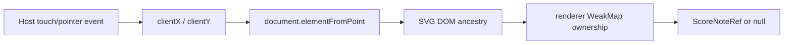
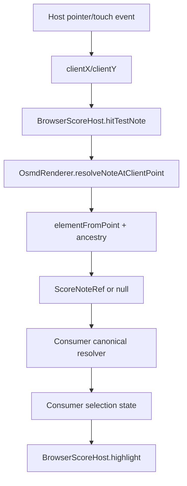
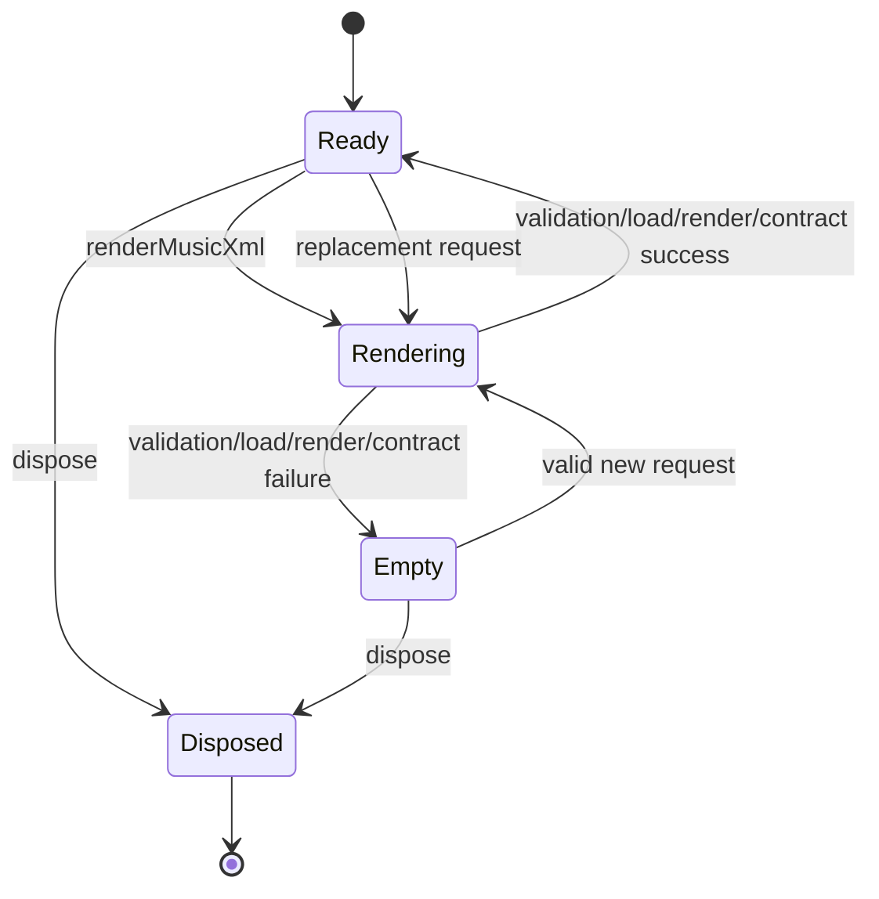
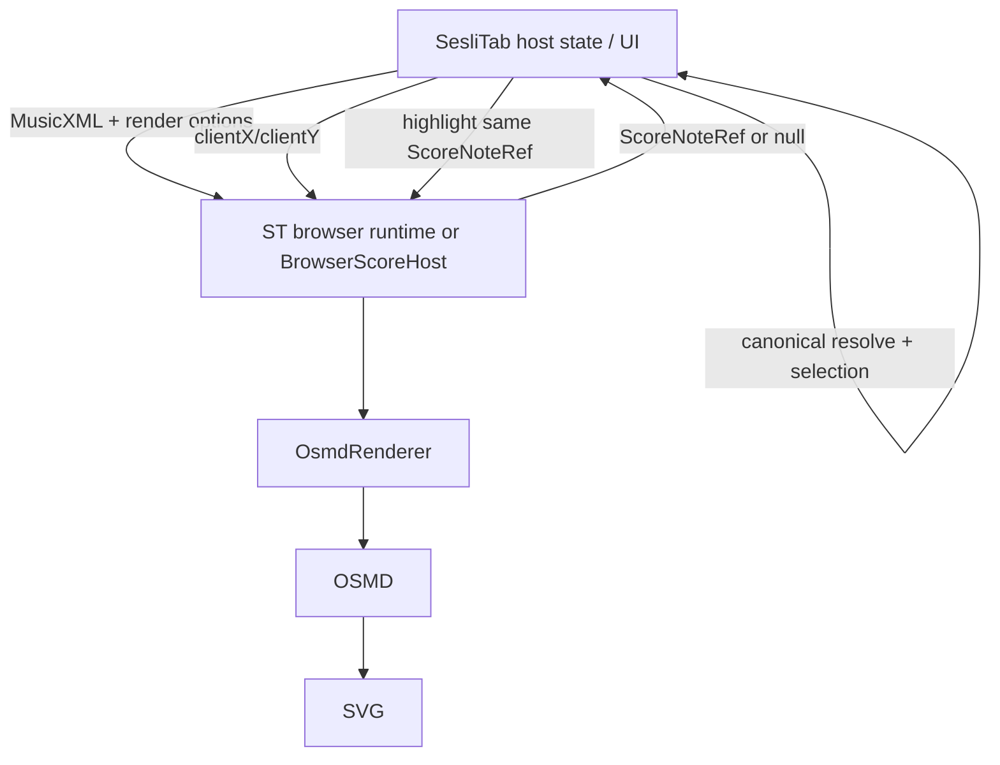
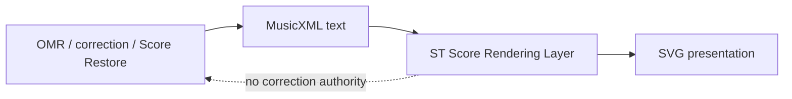

# Production Architecture

This document describes the architecture implemented on production `main`. Code and executable tests are authoritative when older stage/history text conflicts with this document.

Implementation roots:

- `packages/contracts/src/index.ts`
- `packages/renderer-core/src/index.ts`
- `packages/adapter-osmd/src/index.ts`
- `packages/adapter-osmd-headless/src/index.ts`
- `packages/browser-host/src/index.ts`
- `packages/accessibility/src/index.ts`
- `scripts/export-workstation-runtime.mjs`
- `scripts/export-workstation-runtime-with-cursor.mjs`
- `scripts/export-browser-runtime.mjs`

## 1. System purpose

`st-score-rendering-layer` is the ST-owned notation **presentation boundary**. It isolates consumer applications from renderer-vendor APIs while providing a small renderer contract, browser/headless OSMD adapters, interaction primitives, accessibility presentation metadata and exported browser runtime assets.

The production browser renderer uses OpenSheetMusicDisplay (OSMD) `2.1.2` with an SVG backend.

## 2. Scope and non-goals

### Owned here

- bounded in-memory MusicXML source validation;
- renderer lifecycle contracts;
- MusicXML-to-SVG presentation through the OSMD adapter;
- SVG export;
- measure cursor delegation;
- note highlight presentation state;
- deterministic rendered-note location (`ScoreNoteRef`);
- browser client-point hit-testing against rendered notes;
- part visibility delegation;
- validated guitar TAB presentation capability;
- headless Chrome/Chromium SVG rendering and deterministic digest support;
- reversible accessibility metadata overlay;
- ST-owned browser/Workstation runtime asset export.

### Not owned here

- file upload or application navigation;
- PDF/image recognition or OMR;
- MXL archive decoding;
- JSON/ScoreGraph import;
- canonical score correction or editing;
- pitch/duration/voice musical authority;
- playback, transport, tempo, MIDI scheduling or audio output;
- authentication/business UI;
- persistent selected-note application state;
- consumer canonical-note identity.

There is **no ScoreGraph implementation in this repository**. The renderer receives MusicXML text and delegates parsing, graphical model construction, layout and notation drawing to OSMD. Any ScoreGraph/canonical model belongs upstream or to a consumer.

## 3. High-level architecture

```mermaid
flowchart TD
  Consumer[Consumer / host application]
  Runtime[BrowserScoreHost or exported runtime]
  Contracts[@st/score-renderer-contracts]
  Core[@st/score-renderer-core]
  Adapter[@st/score-renderer-osmd]
  Vendor[OpenSheetMusicDisplay 2.1.2]
  SVG[SVG DOM in owned container]
  Interaction[DOM ownership / hit-test index]
  A11y[@st/score-renderer-accessibility]

  Consumer --> Runtime
  Runtime --> Contracts
  Runtime --> Core
  Runtime --> Adapter
  Adapter --> Core
  Adapter --> Contracts
  Adapter --> Vendor
  Vendor --> SVG
  SVG --> Interaction
  Interaction --> Runtime
  A11y -. injected RenderedTargetResolver .-> SVG
```

The browser-host package does not depend directly on `opensheetmusicdisplay`; vendor ownership ends in `@st/score-renderer-osmd`.

## 4. Import and rendering pipeline

The production input pipeline is intentionally narrow:

```mermaid
flowchart LR
  XML[In-memory MusicXML string]
  Validate[validateScoreSource]
  Host[BrowserScoreHost]
  Load[OsmdRenderer.load]
  OSMDLoad[OSMD load / vendor parse]
  Render[OsmdRenderer.render]
  Layout[OSMD layout + SVG rendering]
  Index[rebuildHitTestIndex]
  Output[Rendered SVG DOM]

  XML --> Validate --> Host --> Load --> OSMDLoad --> Render --> Layout --> Output --> Index
```



`validateScoreSource()` checks only the ST source contract: source kind, non-empty content, NUL rejection and byte limit. It is not a MusicXML semantic validator. Vendor parsing/layout failures propagate from OSMD.

Supported source kinds at the ST contract boundary:

| Source | Status |
| --- | --- |
| in-memory MusicXML text | SUPPORTED |
| MXL/compressed MusicXML | UNSUPPORTED |
| PDF | UNSUPPORTED |
| image/photo | UNSUPPORTED |
| JSON / ScoreGraph | UNSUPPORTED |
| URL/network source | UNSUPPORTED |

An upstream OMR/correction system must first produce MusicXML text before this repository can render it.

## 5. Score data and identity model

The repository does not own a canonical semantic score graph. Its stable presentation references are defined in `packages/contracts/src/index.ts`.

`ScoreNoteRef`:

```ts
{
  partId: string;
  measureIndex: number;
  noteIndex: number;
  voice?: number;
}
```

The browser OSMD adapter derives this locator from OSMD graphical traversal:

```text
part / Instrument.IdString
→ instrument staves sorted by idInMusicSheet
→ graphical staff-entry order
→ graphical voice-entry order
→ graphical note order
```

When a safe MusicXML/OSMD voice id exists, `noteIndex` is counted within that voice. Otherwise `voice` is omitted and `noteIndex` is the unfiltered part+measure traversal index.

### Identity boundaries

| Identity | Owner | Meaning |
| --- | --- | --- |
| canonical/source identity | upstream/consumer | authoritative musical event identity, if the consumer has one |
| `ScoreNoteRef` | ST renderer contract | deterministic rendered-note locator |
| OSMD graphical object identity | OSMD adapter only | vendor-internal graphical object; never a consumer contract |
| SVG/DOM element identity | browser render instance | ephemeral rendered target; rebuilt/reindexed after render changes |

`ScoreNoteRef.noteIndex` must never be treated as a consumer-global note-array index.

## 6. Rendering ownership

ST does not implement separate page/system/staff/measure/note drawing engines. Those graphical responsibilities are delegated to OSMD.

ST-owned layers are instead:

1. source/contract validation;
2. adapter option mapping;
3. vendor isolation;
4. owned presentation container lifecycle;
5. rendered-note locator traversal;
6. interaction/highlight/accessibility overlays;
7. exported runtime packaging/integrity.

OSMD produces the SVG DOM. `exportSvg()` serializes the SVG elements currently in the owned container.

## 7. Coordinate model

There is no ST-owned score-coordinate transform pipeline.

The interaction API accepts browser viewport coordinates:

```ts
{ clientX: number; clientY: number }
```

The adapter calls `document.elementFromPoint(clientX, clientY)` and walks the returned DOM ancestry until the renderer container.



The browser therefore accounts for current scrolling and rendered CSS/SVG transforms when resolving the DOM hit. This repository performs no manual scroll-offset, device-pixel-ratio, pinch-zoom or score-space calculation.

### Visual geometry vs interaction geometry

**Visual geometry** is the geometry OSMD renders into SVG.

**Interaction geometry** is DOM ownership registered by the ST adapter:

- exact notehead element; and
- when uniquely owned, the graphical-note group and descendants such as stem/flag/dot.

Interaction geometry is therefore not identical to the visible notehead, but it is also not an arbitrary expanded bounding box. Shared graphical groups fail closed. There is no radius/nearest-note fallback.

## 8. Note interaction architecture

The renderer does not install pointer/touch handlers. The host application owns gesture/event binding and decides when to call `hitTestNote()`.



Important ownership rule: **selection state is not stored by `BrowserScoreHost` or `OsmdRenderer`**. The renderer owns only reversible highlight presentation. Deselect behavior belongs to the consumer, typically by clearing consumer selection and calling `clearHighlights()`.

Ambiguous DOM ownership, rests, whitespace, outside nodes and unmapped symbols return `null`. No pitch matching or nearest-note inference is allowed.

See [NOTE-INTERACTION.md](NOTE-INTERACTION.md).

## 9. Render lifecycle

### BrowserScoreHost replacement lifecycle



Detailed replacement sequence:

```text
renderMusicXml(request)
→ reject concurrent render
→ construct ScoreSource
→ validateScoreSource
→ dispose old renderer + clear container
→ create fresh renderer
→ require musicxml-render + svg-export
→ renderer.load
→ renderer.render
→ verify returned contract version
→ return ScoreRenderResult
```

If validation, loading, rendering, capability checking or contract checking fails, the current renderer is disposed and the container is cleared. Stale notation is not retained after a failed replacement.

The adapter itself can also rerender after `setPartVisible()`. Highlight and hit-test indexes are cleared/rebuilt around render changes.

### Resize/reflow

`ScoreRenderOptions.autoResize` is mapped to OSMD and defaults to `true` in the browser adapter. This repository does **not** implement a `ResizeObserver`, orientation-change listener, font-load listener or Safari-specific reflow controller. Any OSMD-internal resize behavior is vendor behavior, not an ST lifecycle contract.

No ST code restores a selection after rerender because selection is consumer-owned. A deterministic `ScoreNoteRef` can remain equal when traversal is unchanged; DOM identities are ephemeral and the hit-test index is rebuilt.

## 10. State management

```mermaid
flowchart TD
  HostState[Consumer state: selected note / app / playback]
  BH[BrowserScoreHost]
  Renderer[OsmdRenderer]
  Vendor[OSMD instance]
  DOM[SVG DOM]

  HostState -->|MusicXML + options| BH
  BH -->|load/render| Renderer
  Renderer --> Vendor --> DOM
  DOM -->|hit-test result| Renderer --> BH -->|ScoreNoteRef|null| HostState
  HostState -->|highlight target| BH --> Renderer --> DOM
```

ST-owned runtime state:

- `BrowserScoreHost`: current renderer reference, disposed flag, render-in-flight flag;
- `OsmdRenderer`: OSMD instance, loaded/rendered flags, highlight map, hit-test `WeakMap`;
- headless renderer: current source and last SVG pages;
- accessibility bridge: applied target snapshots and focus order.

Not present here: canonical score state, selected-note state, playback state, global app state or persistent viewport model.

## 11. Playback/audio boundary

There is no playback controller, transport, tempo engine, MIDI scheduler, synthesizer or audio output in this repository.

Accordingly, these are separate concepts:

- source accepted by renderer;
- score successfully rendered;
- interaction available;
- playback available in a consumer;
- OMR/correction fully validated.

The renderer cannot declare a score “playable” or “unplayable”. Incomplete OMR must not be blocked from playback **by this renderer**, because this repository has no playback gate. Any playback policy must be implemented and documented in the host application independently.

## 12. Host application boundary

Renderer/browser-host responsibilities:

- source contract validation;
- presentation lifecycle;
- rendering and SVG export;
- renderer capability checks;
- cursor/highlight/hit-test primitives;
- presentation-only accessibility bridge.

Host responsibilities:

- file upload/import UX;
- converting PDF/image/MXL/etc. into supported input before renderer invocation;
- toolbar/navigation/modals;
- app/global state;
- pointer/touch listener registration;
- selected-note/deselection state;
- canonical score resolution;
- playback controls/audio state;
- authentication/business rules.

## 13. SesliTab integration contract



The safe reverse event flow is:

```text
rendered DOM hit
→ renderer ScoreNoteRef
→ host callback / imperative result
→ SesliTab canonical resolver
→ SesliTab selection state
→ renderer highlight
```

This repository does not prove or define SesliTab's canonical mapping. It only defines the renderer side of the boundary. See [CONSUMER-INTEGRATION.md](CONSUMER-INTEGRATION.md).

## 14. OMR / correction / Score Restore boundary

The renderer:

- does not perform OMR;
- does not correct MusicXML;
- does not select between OMR engines;
- does not own confidence/provenance semantics;
- does not mutate a source score as part of selection/highlight;
- can render MusicXML produced by external systems if it satisfies the renderer input contract and OSMD can parse/render it.

ST Score Restore, ST OMR Correction Engine, ScoreMosaic, Audiveris-derived producers and other recognizers are upstream producers/consumers, not dependencies of this repository.



## 15. Guitar / tablature support

Support means **ST contract/test evidence**, not every notation feature OSMD may happen to display.

| Feature | Status | Evidence |
| --- | --- | --- |
| standard notation | SUPPORTED | browser/headless MusicXML render gates |
| TAB staff | SUPPORTED | `tests/browser/osmd-tablature-fixture.html` |
| combined standard notation + TAB | SUPPORTED | same two-staff guitar fixture |
| six-line guitar TAB | SUPPORTED | fixture asserts one TAB staff with six lines |
| MusicXML technical string/fret display | DISPLAY_ONLY | fixture asserts fret labels `7` and `12`; no semantic guitar API |
| note voice/staff traversal for interaction | SUPPORTED | note-interaction tests |
| hammer-on | UNSUPPORTED | no ST capability/contract/test |
| pull-off | UNSUPPORTED | no ST capability/contract/test |
| slide | UNSUPPORTED | no ST capability/contract/test |
| bend | UNSUPPORTED | no ST capability/contract/test |
| technique-specific tie/slur semantics | UNSUPPORTED | no ST technique contract/test |

`UNSUPPORTED` here means “not a guaranteed ST renderer capability”; it does not assert that OSMD can never visually render such MusicXML.

## 16. Mobile / iPhone / Safari architecture

There is no Safari-specific code path and no automated WebKit/Safari job.

The interaction implementation is browser-generic:

- host supplies `clientX/clientY`;
- adapter uses `elementFromPoint()`;
- exact notehead/unique graphical group establishes deterministic ownership;
- shared groups abstain.

PR #16 records real iPhone/Safari acceptance evidence that exact-notehead-only ownership was too narrow and motivated the unique graphical-group widening. Repository CI itself proves narrow responsive rendering at 320px in Chrome/Chromium, not Safari.

`touch-action`, passive listeners, pinch zoom, safe-area layout and gesture policy are host/application responsibilities unless a future renderer-owned implementation is added.

See [MOBILE-SAFARI.md](MOBILE-SAFARI.md).

## 17. Error and degraded modes

The browser host is intentionally fail-closed for stale presentation: failed replacement clears previous output.

The repository has no generic “partially valid MusicXML” or “partially renderable” state machine. A non-empty source can still fail in OSMD parsing/rendering. Unsupported interactive capability methods fail explicitly.

Headless rendering deliberately has no cursor/highlight/part-visibility capability.

See [DEGRADED-MODES.md](DEGRADED-MODES.md).

## 18. Performance architecture

Verified ST-owned mechanisms:

- hit-test ownership stored in a `WeakMap`;
- hit-test index rebuilt after render/part-visibility rebuild;
- hard bound of 200,000 indexed graphical notes per browser render;
- MusicXML input default bound of 5 MiB;
- headless browser timeout/output bounds;
- accessibility map/label bounds;
- no concurrent browser-host replacement render;
- exported runtime assets are local and integrity-manifested.

Not implemented as ST architecture: virtualization, incremental page rendering, lazy score pages, memoized layout, geometry cache, custom resize debounce/throttle or spatial hit-test tree. OSMD may have internal optimizations, but they are not ST contracts.

## 19. Public API boundary

All current workspace packages are `private: true`, but each exposes a package `.` entrypoint for internal workspace/runtime use. The stable cross-layer protocol is `SCORE_RENDERER_CONTRACT_VERSION = "0.2.0"`, independent of package SemVer.

The base `ScoreRenderer` interface does **not** require note hit-test. `resolveNoteAtClientPoint()` and `resolveRenderedNoteElement()` are OSMD-adapter extensions; `BrowserScoreHost.hitTestNote()` is the consumer-facing browser-host abstraction.

The exported runtime global exposes a reviewed imperative presentation surface, not vendor objects.

See [PUBLIC-API.md](PUBLIC-API.md).

## 20. Testing architecture

The protected-branch `foundation` workflow performs:

1. TypeScript typecheck/build/unit tests (`npm run check`);
2. real Chrome/Chromium browser fixtures (`npm run test:browser`);
3. real headless visual-regression gate (`npm run test:headless`).

There is no automated Safari/WebKit gate and no ScoreGraph/playback/OMR test because those components do not exist here.

See [TESTING.md](TESTING.md).

## 21. Architecture invariants

The following are code/test backed:

1. Consumer code must not require OSMD objects through the ST contract/browser-host boundary.
2. Accepted ST source kind is bounded in-memory MusicXML only.
3. Browser replacement failure clears stale renderer-owned presentation.
4. Only one BrowserScoreHost replacement render may be in flight.
5. `ScoreNoteRef` is deterministic from rendered traversal; pitch/duration/proximity are not identity inputs.
6. Ambiguous note DOM ownership fails closed rather than guessing.
7. Highlighting mutates renderer-owned DOM presentation state, not source MusicXML colors.
8. Hit-test DOM ownership is rebuilt after render changes; stale DOM is not retained by the current WeakMap index.
9. Selection/canonical musical authority remains outside the renderer.
10. Accessibility application resolves all targets before mutation and restores captured attributes on clear/dispose.
11. Headless adapter does not advertise interactive capabilities.
12. Exported runtime page policy disables network connections with CSP.
13. Rendering code has no playback/audio/MIDI/realtime authority.

## 22. Terminology

| Term | Production meaning |
| --- | --- |
| Score source | `ScoreSource`, currently MusicXML text only |
| `ScoreNoteRef` | deterministic rendered-note locator |
| canonical note | consumer/upstream authoritative musical identity; not implemented here |
| visual geometry | OSMD-produced SVG geometry |
| interaction geometry | exact notehead plus uniquely-owned graphical group DOM ownership |
| hit region | DOM elements that resolve deterministically to one `ScoreNoteRef` |
| highlight | reversible renderer-owned SVG class/attribute state |
| selection | consumer-owned application state |
| browser host | `BrowserScoreHost`, ST-owned presentation/lifecycle boundary |
| adapter | ST implementation that isolates a renderer vendor |
| browser runtime | exported consumer-neutral local asset graph exposing `__ST_SCORE_RENDER_HOST__` |

## 23. Detailed documents

- [Production-reality audit](PRODUCTION-REALITY-AUDIT.md)
- [Adapter contract](ADAPTER-CONTRACT.md)
- [Browser host](BROWSER-HOST.md)
- [Note interaction](NOTE-INTERACTION.md)
- [Mobile / Safari](MOBILE-SAFARI.md)
- [Consumer / SesliTab integration](CONSUMER-INTEGRATION.md)
- [Public API](PUBLIC-API.md)
- [Degraded modes](DEGRADED-MODES.md)
- [Testing architecture](TESTING.md)
- [Versioning](VERSIONING.md)
