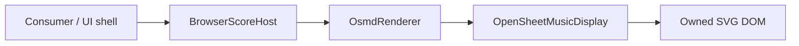

# Browser Host Boundary

`@st/score-renderer-browser-host` is the consumer-facing ST browser presentation/lifecycle boundary. Historical R8-B1 naming describes its origin; this document describes the current production surface.

Implementation: `packages/browser-host/src/index.ts`.

## Purpose



The host accepts bounded in-memory MusicXML and delegates presentation through an ST renderer. It never exposes OSMD model objects to the consumer.

## Authority boundary

The host owns:

- its presentation container;
- one current renderer instance;
- replacement-render lifecycle;
- runtime contract compatibility checks;
- delegation for SVG export, measure cursor, note hit-test and highlight.

The host does not own:

- file/network loading;
- canonical score state;
- selected-note state;
- playback/audio/MIDI/transport;
- application navigation/toolbars;
- authentication/business state;
- OMR/correction/editing;
- pointer/touch event registration.

## Compatibility handshake

Construction requires `expectedContractVersion`. It must equal `SCORE_RENDERER_CONTRACT_VERSION`, currently `0.2.0`, before a renderer is created.

After rendering, `ScoreRenderResult.contractVersion` is checked again. A mismatch fails closed with `ScoreRendererContractVersionMismatchError`.

Runtime protocol compatibility is deliberately separate from private package SemVer.

## Input contract

`renderMusicXml(content, options?, sourceId?)` constructs:

```ts
{
  kind: "musicxml",
  content,
  sourceId?
}
```

Validation is delegated to `validateScoreSource()`:

- only `kind: "musicxml"`;
- non-empty text;
- no NUL bytes;
- default maximum 5 MiB.

No URL loader, PDF/image reader, MXL decoder, ScoreGraph parser or JSON source path exists in the browser host.

## Replacement lifecycle

A render request is a replacement of renderer-owned presentation state.

```text
renderMusicXml
→ reject if disposed or another replacement is in flight
→ validate new source
→ dispose old renderer + clear owned container
→ create fresh renderer
→ require musicxml-render + svg-export
→ renderer.load
→ renderer.render
→ verify returned contract version
→ expose successful result
```

If source validation, renderer construction/capability checking, load, render or result-contract checking fails, the current renderer is reset and the container is cleared. The host deliberately avoids leaving stale notation visible after a failed replacement.

A concurrent replacement is rejected **without** disposing or mutating the render already in flight.

If `dispose()` occurs while a render is in flight, availability checks prevent the stale operation from being accepted as a successful completion.

## Presentation API

Current class methods:

```ts
renderMusicXml(content, options?, sourceId?)
exportSvg()
moveCursor(target)
hitTestNote({ clientX, clientY })
highlight({ target, className? })
clearHighlights()
dispose()
```

### `hitTestNote`

The host validates finite browser client coordinates and delegates to a renderer that structurally implements `resolveNoteAtClientPoint()`.

Hit-testing is not a required method on the base `ScoreRenderer` interface in contract `0.2.0`.

The host does not convert coordinates, search nearest notes or resolve canonical musical identity.

### Highlight

`highlight()` requires the renderer's `note-highlight` capability and delegates the `ScoreNoteRef`. Highlight state is presentation-only and does not mean that the host owns a selected-note model.

### Cursor

`moveCursor()` requires the `cursor` capability. The current OSMD implementation moves to a validated measure index and checks the requested `partId` exists.

## Exported runtime forms

There are two build-time runtime outputs on top of the same browser-host boundary.

### Workstation runtime

Built by `scripts/export-workstation-runtime-with-cursor.mjs`.

It contains local ST modules, the exact OSMD browser bundle, integrity/provenance manifest data, the Workstation bridge, cursor and note-interaction operations.

### Generic browser runtime

Built by `scripts/export-browser-runtime.mjs`.

It is derived from the same runtime graph but removes the Workstation/JUCE-native shell and exposes the consumer-neutral browser runtime. Its manifest sets:

```json
{ "runtimeTarget": "browser" }
```

Both runtime pages use a CSP with `connect-src 'none'` and local renderer/vendor assets.

## Global runtime host

The exported interactive runtimes expose the ST-owned presentation host as:

```js
globalThis.__ST_SCORE_RENDER_HOST__
```

The interaction-capable runtime surface includes:

```js
renderMusicXml(payload)
exportSvg()
moveCursor(payload)
hitTestNote(payload)
highlight(payload)
clearHighlights()
dispose()
```

Runtime bootstrap validation rejects malformed/non-plain payloads, unknown interaction fields, unsafe part IDs, non-finite points, unsafe integer locators and unsafe highlight class tokens.

No OSMD object traversal is exposed through this global.

## Resize and mobile behavior

`ScoreRenderOptions.autoResize` is passed to the adapter/OSMD. The browser host itself contains no `ResizeObserver`, pointer/touch listener, orientation listener or mobile-specific coordinate conversion.

Hosts must bind user events and pass `clientX/clientY` to `hitTestNote()`.

See [MOBILE-SAFARI.md](MOBILE-SAFARI.md) and [NOTE-INTERACTION.md](NOTE-INTERACTION.md).

## Test protection

Key tests:

- `tests/browser-host.test.mjs`: lifecycle, replacement clearing, concurrency, disposal, contract/capability gates and authority boundary;
- `tests/browser-host-interaction.test.mjs`: hit-test/highlight surface and fail-closed interaction states;
- `tests/browser-host-cursor.test.mjs`: cursor delegation;
- `tests/browser/osmd-browser-host-fixture.html`: real browser host → adapter → OSMD rendering;
- `tests/browser-runtime-export.test.mjs`: consumer-neutral exported runtime surface and manifest;
- `tests/workstation-runtime-*.test.mjs`: Workstation runtime export/cursor contract.

The CI browser fixtures use Chrome/Chromium. Browser-host behavior is not automatically exercised in Safari/WebKit by this repository.
