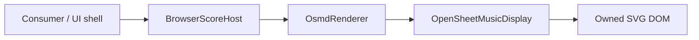

# Browser Host Boundary

`@st/score-renderer-browser-host` is the consumer-facing ST browser presentation/lifecycle boundary. Historical R8-B1 naming describes its origin; this document describes the current production surface.

Implementation: `packages/browser-host/src/index.ts`.

## Purpose



The host accepts bounded in-memory MusicXML and delegates presentation through an ST renderer. It never exposes OSMD model objects to the consumer.

## Authority boundary

The host owns:

- its presentation container;
- one current renderer instance;
- replacement-render lifecycle;
- runtime contract compatibility checks;
- opaque render-generation evidence;
- delegation for SVG export, measure cursor, legacy note hit-test, detailed note hit evidence and highlight.

The host does not own:

- file/network loading;
- canonical score state or `SemanticAddress`;
- selected-note/editor mutation state;
- playback/audio/MIDI/transport;
- application navigation/toolbars/panels;
- authentication/business state;
- OMR/correction/editing;
- pointer/touch event registration.

`ScoreNoteRef` is a rendered locator only.

## Compatibility handshake

Construction requires `expectedContractVersion`. It must equal `SCORE_RENDERER_CONTRACT_VERSION`, currently `0.2.0`, before a renderer is created.

After rendering, `ScoreRenderResult.contractVersion` is checked again. A mismatch fails closed with `ScoreRendererContractVersionMismatchError`.

Runtime protocol compatibility is deliberately separate from private package SemVer. The additive detailed-hit extension must be feature-detected and exact-revision pinned; historical `0.2.0` artifacts do not all contain it.

## Input contract

`renderMusicXml(content, options?, sourceId?)` constructs:

```ts
{
  kind: "musicxml",
  content,
  sourceId?
}
```

Validation is delegated to `validateScoreSource()`:

- only `kind: "musicxml"`;
- non-empty text;
- no NUL bytes;
- default maximum 5 MiB.

No URL loader, PDF/image reader, MXL decoder, ScoreGraph parser or JSON source path exists in the browser host.

## Replacement lifecycle and render epoch

A render request replaces renderer-owned presentation state.

```text
renderMusicXml
→ reject if disposed or another replacement is in flight
→ validate new source
→ dispose old renderer + clear owned container + invalidate active evidence
→ create fresh renderer
→ require musicxml-render + svg-export
→ renderer.load
→ renderer.render
→ verify returned contract version
→ advance opaque renderEpoch
→ expose successful BrowserRenderResult
```

A successful result contains the normal renderer fields plus `renderEpoch` and, when safe/bounded, `sourceId` evidence.

Every successful replacement advances the host-local epoch. Validation failure, load/render failure, renderer reset and dispose invalidate the active epoch/source evidence. The epoch is presentation freshness only; consumers may compare it for equality but must not parse it into editor revision or canonical identity.

A concurrent replacement is rejected **without** disposing or mutating the render already in flight. If `dispose()` occurs during an in-flight render, availability checks prevent stale completion from being accepted.

## Presentation API

Current class methods include:

```ts
renderMusicXml(content, options?, sourceId?)
exportSvg()
moveCursor(target)
hitTestNote({ clientX, clientY })
hitTestNoteDetailed({ clientX, clientY })
highlight({ target, className? })
clearHighlights()
dispose()
```

Current exported browser-host evidence types include `BrowserNoteHitMissReason`, `BrowserRenderEpoch`, `BrowserRenderResult`, `BrowserRenderedHitEvidence`, `BrowserRenderedHitMiss` and `BrowserNoteHitDetailedResult`.

### Legacy `hitTestNote`

The host validates finite browser client coordinates and delegates to a renderer that structurally implements `resolveNoteAtClientPoint()`.

Returns `ScoreNoteRef | null`. Existing semantics remain compatible: there is no nearest-note, radius, pitch or proximity fallback.

### `hitTestNoteDetailed`

Detailed hit-test is additive. It returns bounded current-render evidence:

```ts
{ kind: "HIT", renderEpoch, sourceId?, target: ScoreNoteRef }
```

or:

```ts
{
  kind: "MISS",
  renderEpoch,
  sourceId?,
  reason:
    | "NO_ELEMENT_AT_POINT"
    | "OUTSIDE_RENDER_CONTAINER"
    | "UNMAPPED_ELEMENT"
    | "AMBIGUOUS_OWNERSHIP"
    | "NO_NOTE_OWNER"
}
```

Renderer results are normalized to plain bounded data. DOM elements, OSMD objects and internal ownership maps do not cross the host boundary.

A consumer must compare the returned epoch with its current successful render before canonical resolution. A renderer HIT still requires a consumer/Editor Core canonical mapping step.

### Highlight

`highlight()` requires the renderer's `note-highlight` capability and delegates a current-render `ScoreNoteRef`. Highlight state is presentation-only and does not mean that the host owns a selected-note model.

### Cursor

`moveCursor()` requires the `cursor` capability. The current OSMD implementation moves to a validated measure index and checks the requested `partId` exists.

## Exported runtime forms

There are two build-time runtime outputs on top of the same browser-host boundary.

### Workstation runtime

Built by `scripts/export-workstation-runtime-with-cursor.mjs`. It contains local ST modules, the exact OSMD browser bundle, integrity/provenance manifest data, the Workstation bridge, cursor and note-interaction operations.

### Generic browser runtime

Built by `scripts/export-browser-runtime.mjs`. It is derived from the same runtime graph but removes the Workstation/JUCE-native shell and exposes the consumer-neutral browser runtime. Its manifest sets:

```json
{ "runtimeTarget": "browser" }
```

Both runtime pages use a CSP with `connect-src 'none'` and local renderer/vendor assets.

## Global runtime host

The exported interaction-capable runtimes expose:

```js
globalThis.__ST_SCORE_RENDER_HOST__
```

with bounded methods including:

```js
renderMusicXml(payload)
exportSvg()
moveCursor(payload)
hitTestNote(payload)
hitTestNoteDetailed(payload)
highlight(payload)
clearHighlights()
dispose()
```

Runtime bootstrap validation rejects malformed/non-plain payloads, unknown interaction fields, unsafe part IDs, non-finite points, unsafe integer locators and unsafe highlight class tokens.

No OSMD object traversal or canonical/editor mutation operation is exposed through this global.

## SesliTab consumer handoff

The required ownership chain is:

```text
physical event
→ current client coordinates
→ hitTestNoteDetailed
→ renderer HIT/MISS
→ exact renderEpoch freshness check
→ consumer canonical resolver
→ Editor Core/current canonical selection
→ consumer panel/keypad state
→ renderer highlight(current ScoreNoteRef)
```

Renderer MISS, stale epoch, canonical-map MISS and consumer UI state failure are separate diagnostic classes. See [SESLITAB-DIAGNOSTIC-HANDOFF.md](SESLITAB-DIAGNOSTIC-HANDOFF.md).

## Resize and mobile behavior

`ScoreRenderOptions.autoResize` is passed to the adapter/OSMD. The browser host itself contains no `ResizeObserver`, pointer/touch listener, orientation listener or mobile-specific coordinate conversion.

Hosts bind user events and pass fresh `clientX/clientY` coordinates. Repository CI exercises the bounded interaction fixture in Chromium and the exact-pinned Playwright WebKit engine. WebKit engine success is not physical iPhone/Safari acceptance.

See [MOBILE-SAFARI.md](MOBILE-SAFARI.md) and [NOTE-INTERACTION.md](NOTE-INTERACTION.md).

## Test protection

Key protection includes:

- `tests/browser-host.test.mjs`: lifecycle, replacement clearing, concurrency, disposal, contract/capability and authority boundaries;
- `tests/browser-host-interaction.test.mjs`: legacy/detailed hit and highlight fail-closed states;
- `tests/browser-host-render-epoch.test.mjs`: epoch advancement and invalidation;
- `tests/browser-host-cursor.test.mjs`: cursor delegation;
- `tests/browser/osmd-browser-host-fixture.html`: real browser host → adapter → OSMD rendering;
- `tests/browser/osmd-note-interaction-fixture.html`: 720px/320px exact-selection and rerender evidence;
- `tests/webkit/run-osmd-webkit-fixture.mjs`: bounded WebKit-engine rendering/interaction evidence;
- `tests/browser-runtime-export.test.mjs`: consumer-neutral runtime surface, manifest integrity and deterministic provenance;
- `tests/workstation-runtime-*.test.mjs`: Workstation runtime export/cursor contract.

Physical Safari browser chrome, safe-area, gesture/touch delivery and consumer-shell lifecycle remain external target-device acceptance concerns.
