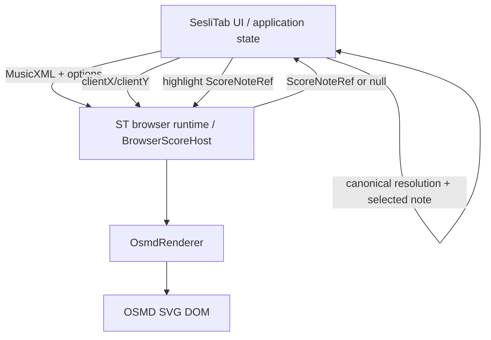

# Consumer Integration

This document defines the current renderer-side integration boundary. It does not infer that a consumer has completed integration unless that fact is verifiable from this repository's owned artifacts/tests.

## Core rule: consumers depend on ST boundaries, not OSMD

Consumer code must use an ST-owned package/runtime boundary. Direct consumer imports of `opensheetmusicdisplay`, OSMD types or OSMD graphical objects are architecture violations.

Internal workspace example:

```ts
import type { ScoreRenderer, ScoreNoteRef } from "@st/score-renderer-contracts";
import { BrowserScoreHost } from "@st/score-renderer-browser-host";
```

The browser host may instantiate `OsmdRenderer` internally; consumers should not make OSMD their application contract.

## Available integration surfaces

### 1. BrowserScoreHost

For a browser host that can consume internal workspace packages:

```text
consumer
→ BrowserScoreHost
→ OsmdRenderer
→ OSMD
→ SVG DOM
```

The consumer supplies in-memory MusicXML and owns its application state/event listeners.

### 2. Generic browser runtime

`scripts/export-browser-runtime.mjs` creates a consumer-neutral local runtime with manifest/integrity metadata and:

```js
globalThis.__ST_SCORE_RENDER_HOST__
```

This runtime exposes render/SVG/cursor/note-hit/highlight/dispose presentation operations without the Workstation-native bridge.

### 3. Workstation runtime

`scripts/export-workstation-runtime-with-cursor.mjs` creates the renderer-owned Workstation asset graph and includes the reviewed native bridge on top of the same BrowserScoreHost/adapter architecture.

### 4. Headless adapter

`@st/score-renderer-osmd-headless` is appropriate for CI/visual QA consumers that need deterministic SVG output, not interactive cursor/highlight/part visibility.

## Source boundary

The only ST `ScoreSource` kind is:

```ts
{ kind: "musicxml", content: string, sourceId?: string }
```

Therefore a consumer with PDF, image, MXL, OMR output, ScoreGraph or another canonical model must perform its own upstream conversion/serialization before calling the renderer.

The renderer does not accept a ScoreGraph object and does not convert PDF/image content into MusicXML.

## SesliTab contract

SesliTab is a natural consumer of the browser presentation/interaction boundary, but this repository does not claim that the entire SesliTab production integration is complete.

The renderer-side contract is:



### Safe note-selection flow

```text
host pointer/touch event
→ renderer hitTestNote(clientX, clientY)
→ ScoreNoteRef or null
→ SesliTab canonical resolver
→ exact canonical event or SesliTab abstain
→ SesliTab selected-note state
→ renderer highlight(same ScoreNoteRef)
```

SesliTab must independently prove how `partId`, `measureIndex`, `noteIndex` and optional `voice` map to its own canonical event identity. The renderer must not infer canonical identity from pitch, duration or proximity.

### Event ownership

SesliTab/consumer owns:

- `pointerdown`/`click`/`touch` listener policy;
- gesture discrimination;
- selected-note and deselection state;
- canonical-note lookup;
- scroll/zoom UX;
- playback and audio state;
- toolbar/business UI.

Renderer owns:

- browser client-point hit-test primitive;
- deterministic rendered-note locator;
- reversible highlight presentation;
- renderer lifecycle/container state.

## Playback independence

The renderer has no playback API. Rendering success, hit-test availability and OMR/correction validation must not be treated as synonyms for playback availability.

If a consumer can play an incomplete OMR result, that policy must remain in the consumer/playback subsystem. There is no renderer-side reason to disable playback merely because notation is partial or interaction is unavailable.

## OMR / Score Restore / ScoreMosaic consumers

These systems may use the renderer for visual QA when they can provide MusicXML, but the renderer never becomes their recognition/correction authority.

```text
OMR / correction / normalization system
→ MusicXML text
→ ST renderer
→ SVG visual evidence
```

Confidence/provenance and correction decisions remain upstream.

## Consumer status boundaries

| Consumer/domain | Renderer-side integration target | What this repo can assert |
| --- | --- | --- |
| ST Music Workstation | renderer-owned Workstation runtime | runtime export and its renderer-side gates are present |
| SesliTab Guitar Reader | generic browser runtime or reviewed BrowserScoreHost boundary | renderer-side interaction contract exists; consumer completion is not inferred here |
| MusicXML-to-Guitar-TAB engine | headless/visual validation | renderer can validate presentation evidence, not fingering logic |
| ScoreMosaic | headless/browser visual QA | no OMR authority |
| ST Score Restore / correction | before/after visual QA | no correction authority |
| editor | read-side preview | editor/write model remains authoritative |

## Integration requirements

Every production consumer should:

1. use ST-owned contracts/runtime boundaries;
2. avoid direct OSMD application dependencies;
3. verify runtime contract version;
4. pin/verify immutable runtime provenance where exported assets are embedded;
5. treat `ScoreNoteRef` as a rendered locator, not a canonical global note ID;
6. keep source/canonical mutation outside renderer highlight/selection operations;
7. keep playback/audio/MIDI/OMR/editing authority outside renderer code;
8. fail closed on malformed renderer/runtime payloads;
9. run the relevant real-runtime gate before advertising a capability.

See [PUBLIC-API.md](PUBLIC-API.md), [NOTE-INTERACTION.md](NOTE-INTERACTION.md) and [ARCHITECTURE.md](ARCHITECTURE.md).
